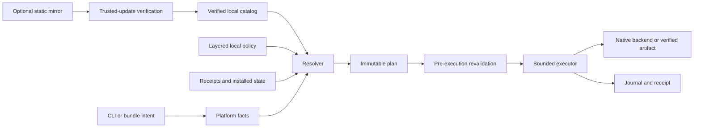

# Architecture

Siorb is a local, plan-first orchestrator. It translates a logical package
request into a typed native-backend operation. It does not provide a package
repository, remote resolver, account service, or privileged daemon.

## Component boundaries

| Crate | Owns | Must not own |
|---|---|---|
| `siorb-cli` | argument parsing, terminal rendering, JSON selection | resolution policy or subprocess construction |
| `siorb-core` | shared domain types, errors, orchestration contracts | OS probing |
| `siorb-platform` | normalized host facts and injectable detection | package selection |
| `siorb-catalog` | manifest parsing, indexes, catalog identity and trust metadata | user consent |
| `siorb-policy` | layered policy and stable decision reason codes | backend execution |
| `siorb-resolver` | deterministic filtering, ranking and explanation | mutation |
| `siorb-planner` | immutable steps, fingerprints, consent and recovery hints | spawning processes |
| `siorb-backends` | typed adapter capabilities and argument vectors | generic shell evaluation |
| `siorb-executor` | bounded subprocesses, per-step privilege and progress | choosing a package source |
| `siorb-state` | transactions, receipts, pins, holds and atomic persistence | claiming backend rollback |
| `siorb-bundle` | portable intent and target-specific locks | cross-platform lock equivalence claims |
| `siorb-update` | trusted metadata and transport-independent updates | treating HTTPS as authenticity |
| `siorb-xtask` | repository verification, generation and release preparation | runtime behavior |

Domain crates return typed values. The CLI is the only boundary that formats
terminal output. Backend adapters consume a validated plan and emit structured
results; they do not resolve names or reinterpret manifest strings.

## Operation lifecycle

1. Parse input and reject incompatible flags without host mutation.
2. Collect normalized platform and backend capabilities through injectable
   providers.
3. Load a bundled or previously verified catalog and layered local policy.
4. Resolve an exact logical identity, filter candidates, apply policy, and rank
   deterministically.
5. Compare with receipts and observed backend state.
6. Serialize a plan containing inputs and security-relevant fingerprints.
7. Ask for the consent described by that plan.
8. Re-read mutable facts immediately before execution. Abort on invalidating
   drift.
9. Journal each step, invoke only its validated executable/arguments, verify the
   result, and commit a receipt atomically.
10. Preserve partial completion and an idempotent recovery action on failure.

Dry-run stops after the complete plan. It is not a reduced or mocked resolver.

## Trust boundaries

The binary and bundled trust root are the initial trust anchors. Catalog files,
mirrors, bundle and policy files, backend executables/output, archives, native
package indexes, environment variables, and existing local state all cross a
trust boundary. HTTPS protects transport confidentiality but does not replace
catalog metadata or artifact verification.

Privilege is also a boundary: detection, catalog verification, resolution, and
planning remain unprivileged. A plan step records whether elevation is needed;
the executor requests it only for that step and never stores credentials.

## Determinism and fingerprints

A resolution decision is a pure function of normalized request, platform facts,
backend capabilities, catalog identity, policy identity, constraints, and
observed state. Candidate ordering has explicit tie-breakers. Plans capture
fingerprints for every mutable input used by that decision, enabling drift
detection before execution and useful incident evidence afterward.

## State and failure model

User state belongs in the platform-standard application data directory. System
receipts are written only for system-scope operations. Atomic file replacement
protects individual records; an append-only transaction journal protects the
multi-step narrative. Native package managers are not assumed transactional.
Siorb reports completed, failed, unstarted, and unverifiable steps separately
instead of promising rollback it cannot provide.

See [ADR-0001](../adr/0001-offline-first-no-service.md),
[ADR-0003](../adr/0003-trusted-static-catalog.md), and the
[threat model](../threat-model.md).
